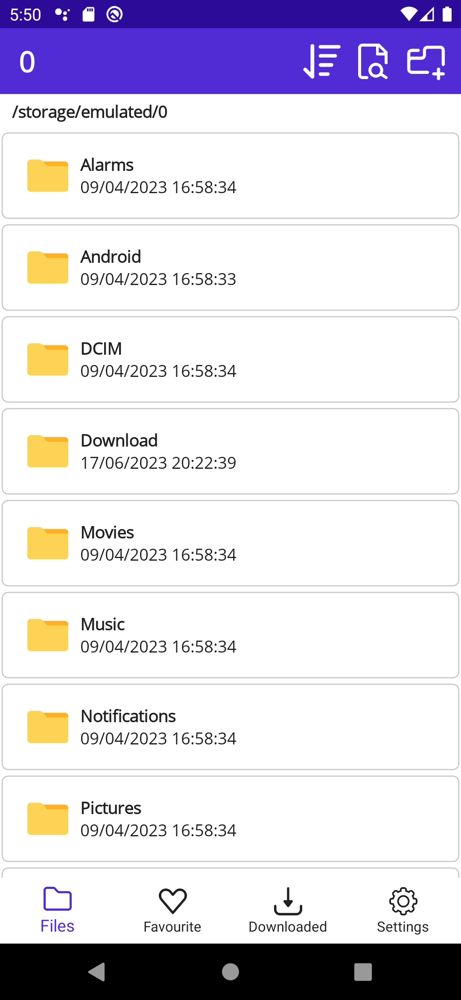
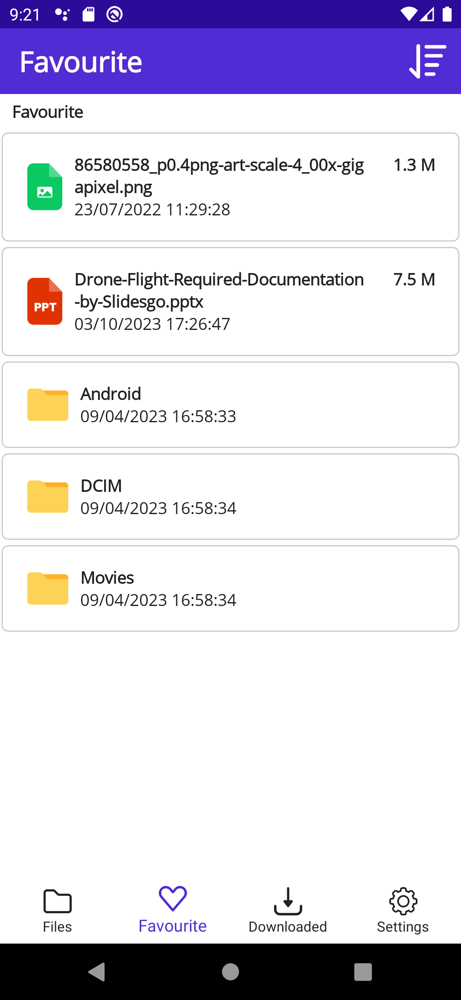
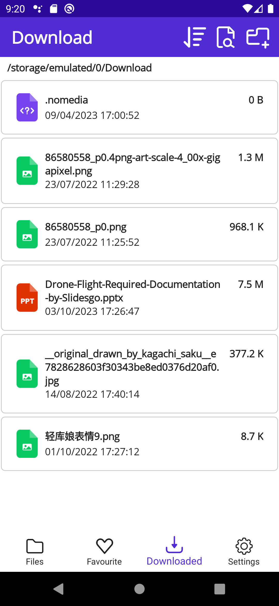
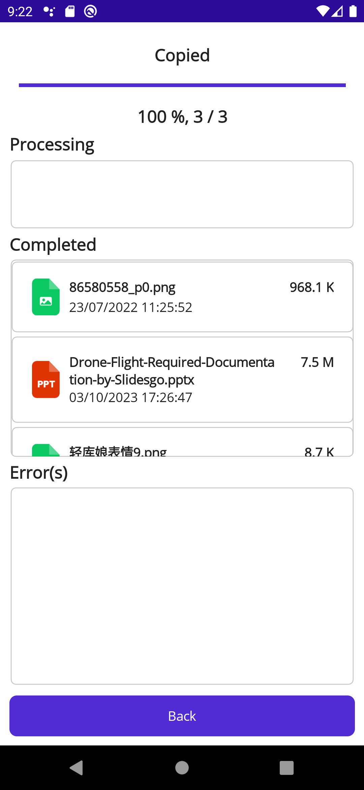

# MaiFileManager

A simple yet powerful with neat-UI file manager for Android, developed with the latest technology of .NET Multi-platform App UI (.NET MAUI: https://dotnet.microsoft.com/en-us/apps/maui).

Made with <3 by Marowota
Best support for Android 10

## Main functionality

- View files and folder 📁
- Show the file size 🏋️‍♂️
- Add files/folder to favourite for easy access 💖
- Fully cut/copy/paste/delete support with progress UI\* ✨
- Darkmode 🌙
- Multiple sort option 📚
- Find and create folder with ease 🍬

\*Slide from left to right to show all functionality, slide from right to left to rename folder

## Images

More image in [SampleImage](SampleImage/) SampleImage folder
